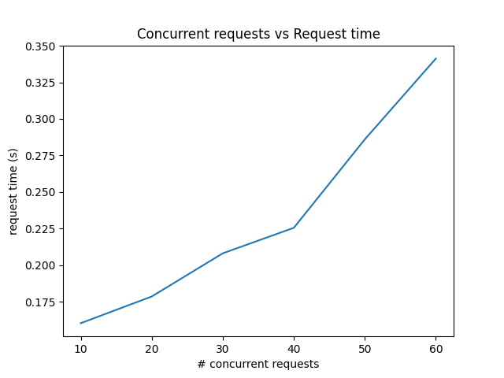

## Requirements
* Python 3.9
* Terraform 1.4.4
* Helm 3.11.2
* Docker 2.10.23
* AWS CLI 2.11.8

## Deploy Infra
```bash
cd scripts
./deploy_infra.sh
```

## Deploy application
```bash
cd scripts
./deploy_app.sh $docker_tag
```

## Plot of response times
